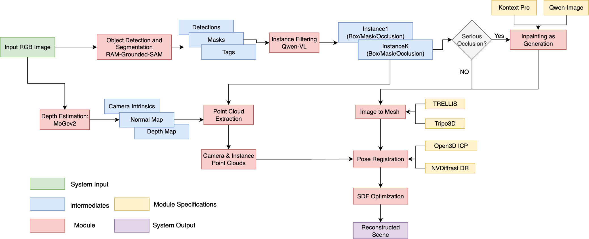

This repo is an unofficial and basic implementation of SIGGRAPH 2025 Best Paper Nominate [CAST: Component-Aligned 3D Scene Reconstruction from an RGB Image](https://arxiv.org/abs/2502.12894). 

To simplify the pipeline, almost all modules of the system are based on existing API (e.g.Replicate/Qwen/Kontext/Tripo3D), making it easy to be deployed on Windows/Linux/MacOS.

### Workflow


### Differences with the Paper 
1. Different from 
2. 

Detailed differences are summarized in the following table:

| Modules | Original Paper | This Repo |
| --- | --- | --- |
| Detection and Caption | Florence2    |  [RAM-Grounded-SAM](https://replicate.com/fishwowater/ram-grounded-sam-maskfixed) |
| Segmentation          | Grounded-SAM |  [RAM-Grounded-SAM](https://replicate.com/fishwowater/ram-grounded-sam-maskfixed) | 
| Detection Filtering   |  GPT-4       |  [Qwen-VL](https://qwen3.org/vl/) | 
| Depth Estimation & PointCloud | MoGev1 |  [MoGev2](https://github.com/microsoft/MoGe/) | 
| Mesh Generation       | Occlusion-Aware self-trained 3D Generative model| [Kontext](https://replicate.com/black-forest-labs/flux-kontext-dev)/[Qwen](https://www.aliyun.com/product/tongyi) + [Tripo3D](https://www.tripo3d.ai)/[TRELLIS](https://replicate.com/firtoz/trellis) | 
| Pose Registration     | Occlusion-Aaware self-trained 3D Generative model | ICP / DR | 
| Physical Post-Processing | Scene Graph Guided SDF | TBD |


### Quick Start 
#### 1. Setup 
``` shell 
# some asyncio support of replicate requires Python3.11 or higher version
conda create -n cast python=3.11 -y
conda activte cast 
python install_setup.py 

# setup env vars for replicate / qwen / tripo
cp .env.example .env 
```

### TODO 
- [ ]  


### Comparison with Existing Works
1. [MIDI-3D](https://github.com/VAST-AI-Research/MIDI-3D)
2. [PartCrafter](https://github.com/wgsxm/PartCrafter)
3. [ArtiScene](https://github.com/NVlabs/ArtiScene)
4. [ReconViaGen](https://github.com/GAP-LAB-CUHK-SZ/ReconViaGen)