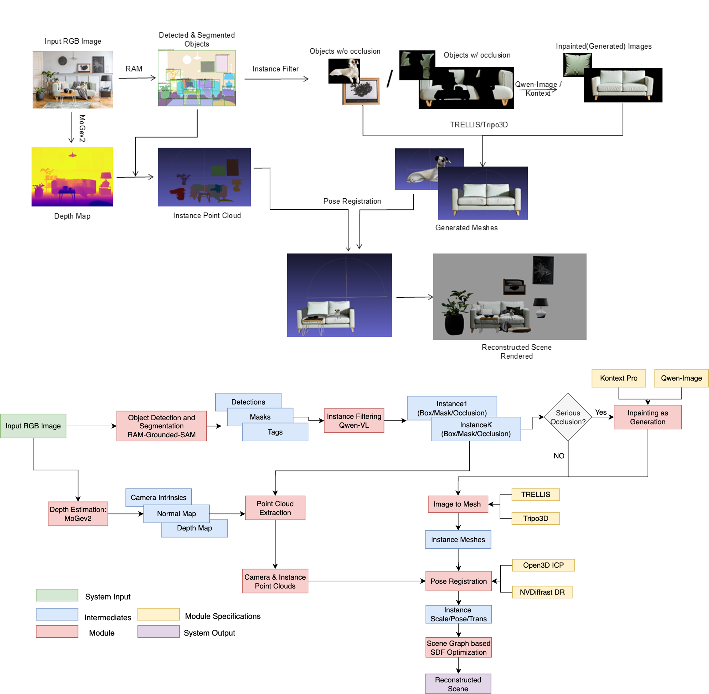
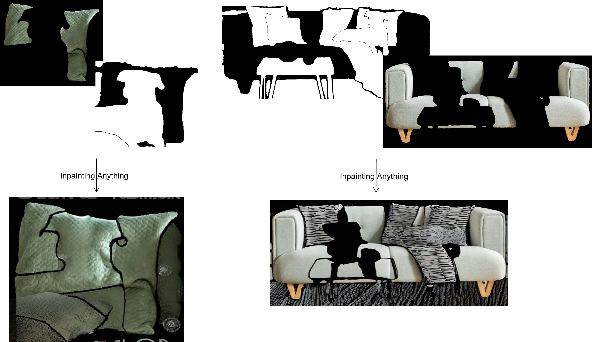
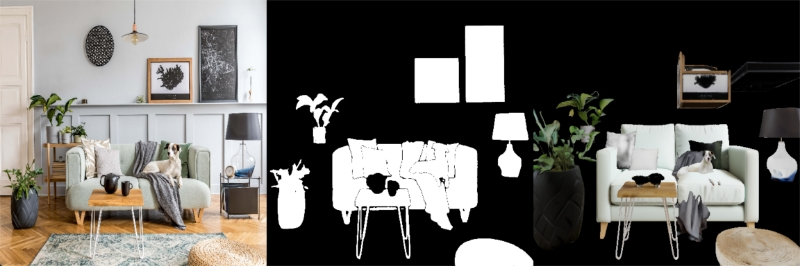

## Unofficial and Simplified Implementation of CAST: Component-Aligned 3D Scene Reconstruction from an RGB Image
This repo demonstrates an unofficial basic implementation of SIGGRAPH 2025 Best Paper Nominate [CAST: Component-Aligned 3D Scene Reconstruction from an RGB Image](https://arxiv.org/abs/2502.12894). 

To simplify the pipeline, almost all modules of the system are based on existing serverless API (e.g.Replicate/Qwen/Kontext/Tripo3D), making it easily deployed on Windows/Linux/MacOS.

### Disclaimer 
This repo is a **proof-of-concept and work-in-progress**. Since we don't want to (nor have the computational resources) to train the occlusion-aware generative model and the iterative registration approach, its performance **is NEVER** expected to approach the performance of the original paper.

### Algorithmic Workflow


### Demo (Qwen as the image inpainter and TRELLIS as the 3D Generator)
You could try Tripo3D for higher quality 3D models 


### Differences with the Paper 
1. Instead of using florence2 to first detect out objects in the image and then use Grounded-SAM to generate masks, here we use **[IDEA's RAM model](https://replicate.com/fishwowater/ram-grounded-sam-maskfixed)** to predict boxes/tags/masks all at once.
2. The original paper puts a lot of efforts in training an occlusion-aware 3D generative model to support the mesh generation of seriously occluded objects in the image, here we use **a simplified and training-free scheme**: use Flux-Kontext / Qwen-Image to inpaint the occluded image, and then use off-the-shelf 3D generators like Tripo3D and TRELLIS to generate 3D models.
3. The original paper implements a point cloud conditioned model and iterative approach to register the 6D pose of an object. Here as we don't have the computational power, again we resort to **ICP(Iterative Closest Point) or Differentiable Rendering** to optimize the pose/scale of generated objects.

Detailed differences are summarized in the following table:

| Modules | Original Paper | This Repo |
| --- | --- | --- |
| Detection and Caption | Florence2    |  [RAM-Grounded-SAM](https://replicate.com/fishwowater/ram-grounded-sam-maskfixed) |
| Segmentation          | Grounded-SAM |  [RAM-Grounded-SAM](https://replicate.com/fishwowater/ram-grounded-sam-maskfixed) | 
| Detection Filtering   |  GPT-4       |  [Qwen-VL](https://qwen3.org/vl/) | 
| Depth Estimation & PointCloud | MoGev1 |  [MoGev2](https://github.com/microsoft/MoGe/) | 
| Mesh Generation       | Occlusion-Aware self-trained 3D Generative model| [Kontext](https://replicate.com/black-forest-labs/flux-kontext-dev)/[Qwen](https://www.aliyun.com/product/tongyi) + [Tripo3D](https://www.tripo3d.ai)/[TRELLIS](https://replicate.com/firtoz/trellis) | 
| Pose Registration     | Occlusion-Aaware self-trained 3D Generative model | [ICP](https://www.open3d.org/docs/release/tutorial/pipelines/icp_registration.html#ICP-registration) / [DR](https://github.com/NVlabs/nvdiffrast/) | 
| Physical Post-Processing | Scene Graph Guided SDF | TO BE DONE |
---


### Quick Start 
#### 1. Setup 
``` shell 
# some asyncio support of replicate requires Python3.11 or higher version
conda create -n cast python=3.11 -y
conda activte cast 
python install_setup.py 

# setup env vars for replicate / qwen / tripo
cp .env.example .env 
```

### 2. Inference 
``` shell 
# check available parameters 
python -m cast.cli -h 
# usage: cli.py [-h] (--image IMAGE | --batch BATCH) [--output OUTPUT] [--no-intermediates] [--run-id RUN_ID] s[--no-resume] [--num-max-objects NUM_MAX_OBJECTS] [--validate-only] [--visualize] [--enable-generation] [--generation-threshold {no_occlusion,some_occlusion,severe_occlusion}] [--discard-threshold {no_occlusion,some_occlusion,severe_occlusion}] [--generation-provider {replicate,qwen}] [--mesh-provider {tripo3d,trellis}] [--mesh-base-url MESH_BASE_URL] [--pose-estimation-backend {icp,pytorch}] [--debug]

# inference example
python -m cast.cli -i assets/indoor.png --output outputs --enable-generation --pose-estimation-backend icp --generation-provider qwen --mesh-provider trellis
```

### Experiments Working in Progress (works or don't)
#### 1. Inpainting-Anything / LAMA : NOT WORK
Maybe because of serious occlusion or the strange silhouette of the occlusion mask, inpainting methods like Lama and Inpainting-Anything fail at generating plausible predictions (as shown below).
Instead we use Qwen-Image / Flux-Kontext, the more powerful and general generation framework.


#### 2. Differentiable Rendering
Working in Progress, may refer to this [thread](https://github.com/NVlabs/nvdiffrast/issues/117) for reference.




### TODO 
- [ ] Further experiment with the differentiable rendering 
- [ ] Implement the scene-graph and SDF guided object pose estimation. 
- [ ] Test More Use Cases


### Comparison with Existing Works
Basically there are two roads to get a component-level reconstruction(generation) from a RGB image: End-to-End or procedural long pipelines.

1. [MIDI-3D](https://github.com/VAST-AI-Research/MIDI-3D) is a promising approach, but it's trained on 3D-Front and the generalization to outdoor scene / objects NOT guaranteed, besides the 6D pose of generated objects often not aligns well with the image.
2. [PartCrafter](https://github.com/wgsxm/PartCrafter) / [PartPacker](https://github.com/NVlabs/PartPacker) is basically object-centric, although PartCrafter has a model trained on 3DFront, an indoor scene dataset.
3. [ArtiScene](https://github.com/NVlabs/ArtiScene) is a promising procedural approach 
4. [ReconViaGen](https://github.com/GAP-LAB-CUHK-SZ/ReconViaGen) is object-centric and requires multi-view images as the input, which is impossible for wide-angle or large scale scenes.

Any discussion and contributions are welcomed, need your help :)

### LICENSE
See [License](./LICENSE), this work is licensed under MIT.

